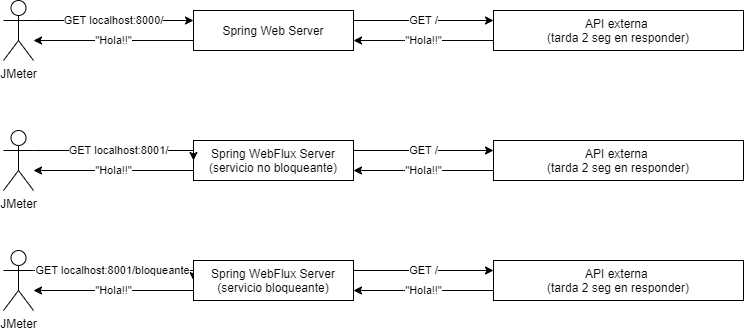
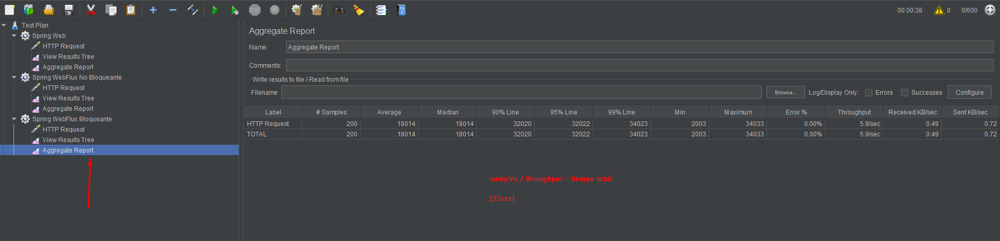

# Web vs Webflux stress tests

Este proyecto busca comparar diferentes implementaciones de este escenario: 
- Spring Web 
- Spring Webflux con un cliente no bloqueante (WebClient)
- Spring Webflux con un cliente bloqueante (RestTemplate)

Con los valores de ejemplo, se estresa la aplicación con 200 requests simultáneas y el API externa tarda 2 segundos. Podés cambiar los números y ver que pasa :D

## Cómo correr las pruebas
1. Abrí esta carpeta con IntelliJ IDEA
2. Corré las aplicaciones (los links te llevan a cada clase main)
    - La API "externa" lenta: [slow-api](slow-api/src/main/kotlin/com/example/slowapi/SlowApiApplication.kt)
    - El servidor Spring Web:  [web-server](web-server/src/main/kotlin/com/example/webserver/WebServerApplication.kt)
    - El servidor Spring WebFlux:  [webflux-server](webflux-server/src/main/kotlin/com/example/webfluxserver/WebfluxServerApplication.kt)
    
3. Corré un JMeter y abrí el plan de pruebas en `jmeter-tests/alltests.jmx`. Si no tenés JMeter descargalo de [acá](https://apache.dattatec.com//jmeter/binaries/apache-jmeter-5.4.zip).
4. Poné play, poné play te dije!!!!!
5. Cada "Aggregate Report" indica los resultados. Se ve algo así:
   