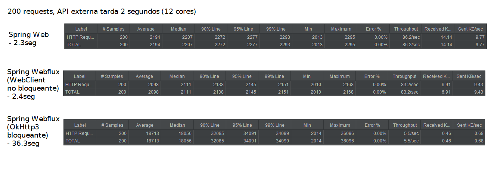

# Web vs Webflux stress tests

Este proyecto busca comparar diferentes implementaciones de un servidor que consume una API HTTP externa (gateway): 
- Spring Web 
- Spring Webflux con un cliente no bloqueante (WebClient)
- Spring Webflux con un cliente bloqueante (RestTemplate)

Con los valores de ejemplo, se estresa la aplicación con 200 requests simultáneas y la API externa tarda 2 segundos. Podés cambiar los números y ver qué pasa :D

## Cómo correr las pruebas (Gatling)
1. Corré `gatling-tests/start-apis.bat`
2. Ejecutá `gatling-tests/test.sh`. Indicá la cantidad de usuarios.
3. Se abrirán en el navegador los resultados 

## Cómo correr las pruebas (JMeter)
1. Abrí esta carpeta con IntelliJ IDEA
2. Corré las aplicaciones (los links te llevan a cada clase main)
    - La API "externa" lenta: [slow-api](slow-api/src/main/kotlin/com/example/slowapi/SlowApiApplication.kt)
    - El servidor Spring Web:  [web-server](web-server/src/main/kotlin/com/example/webserver/WebServerApplication.kt)
    - El servidor Spring WebFlux:  [webflux-server](webflux-server/src/main/kotlin/com/example/webfluxserver/WebfluxServerApplication.kt)
    
3. Corré un JMeter y abrí el plan de pruebas en `jmeter-tests/alltests.jmx`. Si no tenés JMeter descargalo de [acá](https://apache.dattatec.com//jmeter/binaries/apache-jmeter-5.4.zip).
4. Poné play, poné play te dije!!!!!
5. Cada "Aggregate Report" indica los resultados. Se ve algo así:
   
   
Para cambiar la cantidad de peticiones que se hacen en la prueba, configurar cada Thread Group (cada engranaje en JMeter)

Para cambiar el tiempo de tardanza de el servicio "externo", cambiar el tiempo del Thread.sleep en la clase principal de [slow-api](slow-api/src/main/kotlin/com/example/slowapi/SlowApiApplication.kt)

## Algunos resultados

(OkHttp3 y RestTemplate se comportan muy parecido). Los 200 requests se disparan en simultáneo
